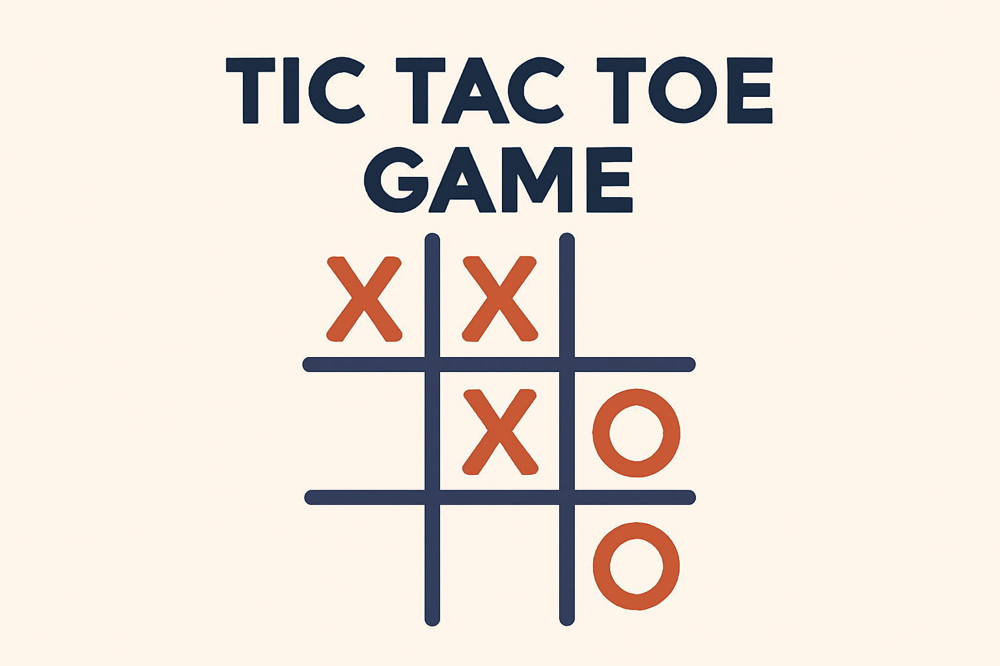

# Tic Tac Toe Game

## Description
A simple implementation of the **Tic Tac Toe** game using Python. This game allows two players to play on a 3x3 board, with the first player using 'X' and the second player using 'O'. The game board is printed after every turn, and the program checks for a winner or a tie after each move.

## Features
- Random selection of the first player
- Alternating turns between two players
- Checks for winning conditions (rows, columns, diagonals)
- Displays the current state of the board after every turn

## How to Run the Program
1. Clone this repository:
    ```bash
    git clone https://github.com/Melikagr/TicTacToe.git
    ```

2. Navigate into the project folder:
    ```bash
    cd TicTacToe
    ```

3. Run the game:
    ```bash
    python src/main.py
    ```

4. Follow the prompts to enter the names of the players.

## Example Gameplay
Please write down the name of first player: Sara  
Please write down the name of second player: Jack  
Jack is X.  
Sara is O.  
Jack begins.  
Please choose one of the squares:
                         
            1 | 2 | 3
           -----------
            4 | 5 | 6
           -----------
            7 | 8 | 9
        
        5


              |   |  
           -----------
              | X |  
           -----------
              |   |  
        
        
## Contributing
Feel free to fork this project, submit issues, or open pull requests for improvements!

## License
This project is licensed under the MIT License - see the [LICENSE](LICENSE) file for details.
